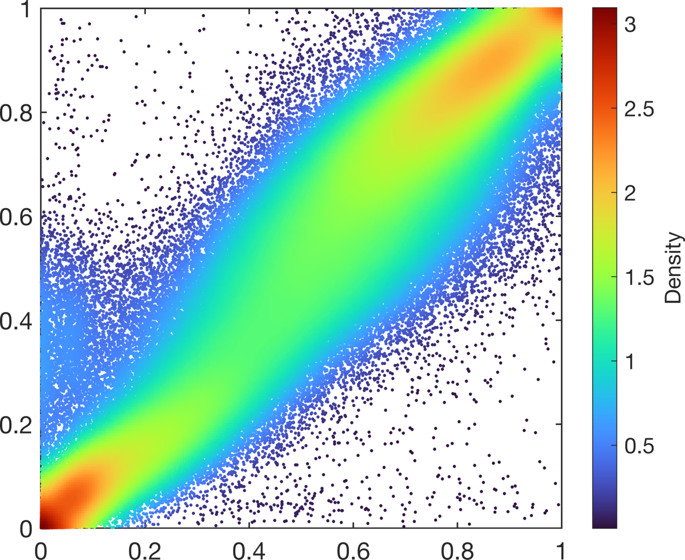

# DensScat
A fast MATLAB function for creating density scatter plots for large datasets

```matlab
% USAGE:
%   fh = DensScat(x, y) makes a density scatter plot using the vectors x & y
%
% INPUTS:
% * x & y are two numeric vectors describing the x-axis & y-axis
% location for each point in the scatter plot
%
% OUTPUTS:
% * fh: figure handle to for the scatter plot
%
% OTHER PARAMETERS passed as parameter-value pairs default in []
% 'MarkerType': Marker type '.od<>^vs+*xph' ['.']
% 'mSize': Integer for Marker size [50 for '.' otherwise 12]
% 'ColorMap': Colormap to be used name eg 'jet' or N*3 matrix [TurboMap builtin]
% 'logDensity': true/false for taking the log10 of the density [true]
% 'AxisSquare': true/false for making axis square [true]
% 'SmoothDensity': true/false for density smoothing [true]
% 'lamda':  Integer for the degree of smoothing [30]
% 'nBin_x': Integer for number of bins along the x-axis [200]
% 'nBin_y': Integer for number of bins along the y-axis [200]
% 'RemovePoints': true/false only plot points that that are unique based on a 1000*1000 grid [true]
%
% The smoothing is based on the following reference:
% Paul H. C. Eilers and Jelle J. Goeman
% Enhancing scatterplots with smoothed densities
% Bioinformatics, Mar 2004; 20: 623 - 628.
%
%%%%%%%%%%%%%%%%%%%%%%%%%%%%%%%%%%%%%%%%%%%%%%%%%%%%%%%%%%%%%%%%%%%%%%%%%%%
% by Anders Berglund, 2020 aebergl at gmail.com               %
%%%%%%%%%%%%%%%%%%%%%%%%%%%%%%%%%%%%%%%%%%%%%%%%%%%%%%%%%%%%%%%%%%%%%%%%%%%
```


## Simple Example ##

The following example is based on Illumina 450K methylation data with 485 577 points
 
```matlab
load DensityScatterPlotExample

fh = DensScat(x,y);

```


